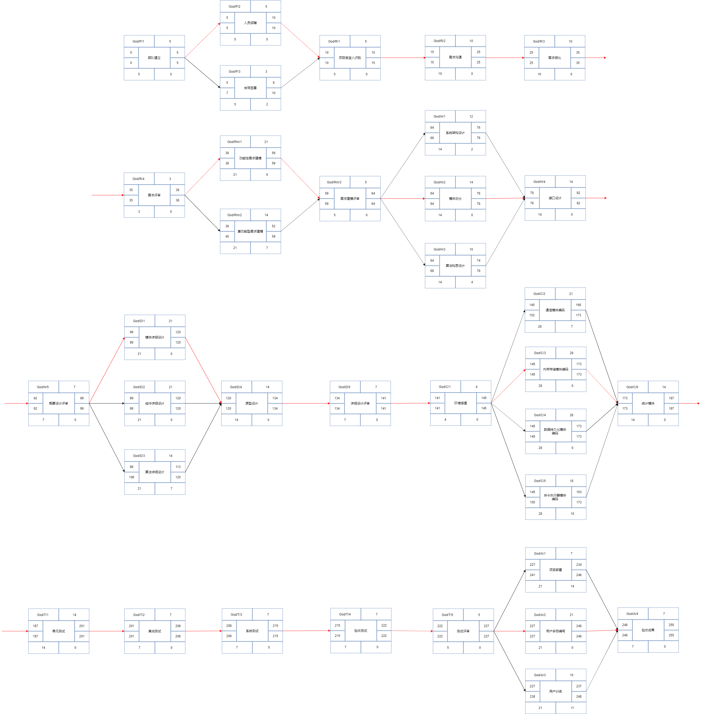
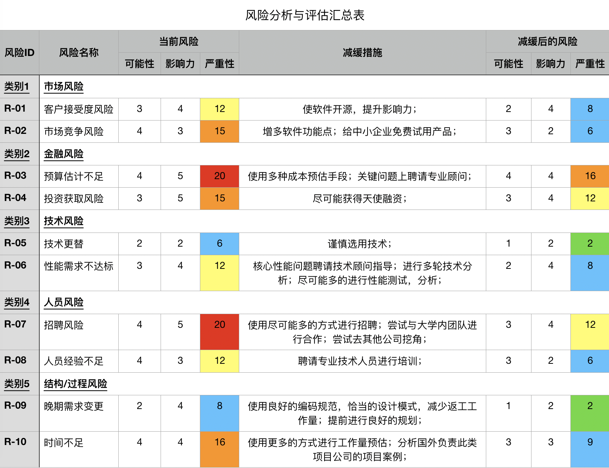

# Project charter

## **Project Name**: 

基于go的分布式端到端的轻量级key-value内存数据库----Godis

## **Project Stakeholders**：

|  Name  |       Role        |  Contact Informatica |
| :----: | :---------------: | :-----------------: |
| 斯邦斯 | 出资人（Sponsor） |    xxx@163.com     |
| 杨紫超 |     项目经理      | 1021777674@qq.com |
| 王笑天 | 产品经理 | 564318045@qq.com |
| 周宇东 | 产品经理 | 1035876723@qq.com |
| 风险管理经理1 | 风险管理经理 | xxx@163.com |
| 风险管理经理2 | 风险管理经理 | xxx@163.com |
| 系统架构师1 | 系统架构师 | xxx@163.com |
| 系统架构师2 | 系统架构师 | xxx@163.com |
| 算法工程师1 | 算法工程师 | xxx@163.com |
| 算法工程师2 | 算法工程师 | xxx@163.com |
| 算法工程师3 | 算法工程师 | xxx@163.com |
| 算法工程师4 | 算法工程师 | xxx@163.com |
| 研发工程师1 | 研发工程师 | xxx@163.com |
| 研发工程师2 | 研发工程师 | xxx@163.com |
| 研发工程师3 | 研发工程师 | xxx@163.com |
| 研发工程师4 | 研发工程师 | xxx@163.com |
| 研发工程师5 | 研发工程师 | xxx@163.com |
| 测试工程师1 | 测试工程师 | xxx@163.com |
| 测试工程师2 | 测试工程师 | xxx@163.com |
| 测试工程师3 | 测试工程师 | xxx@163.com |
| 测试工程师4 | 测试工程师 | xxx@163.com |
| 文档工程师1 | 文档工程师 | xxx@163.com |
| 文档工程师2 | 文档工程师 | xxx@163.com |
| 文档工程师3 | 文档工程师 | xxx@163.com |
| 运维工程师1 | 运维工程师 | xxx@163.com |

## **Project Description**：

国内的制作基础设施架构应用的公司并不多，大多数互联网公司，传统行业公司采用的缓存系统大多数为国外企业的分布式key-value内存缓存数据库，如memcached，redis等，而国内在该产业几乎是空白。

所以，开发这样一款数据库产品不仅能打响公司声誉，更能迅速在市场上取得一定的占有率，但同时也应注意到开发Godis这样一款产品的技术难度较高，风险较大。

Godis是一个轻量级的端到端的key-value内存数据库产品Godis，该产品将为所需要使用web技术的公司和组织提供一个高速的、高并发的、分布式的内存缓存解决方案，可用作数据库、缓存或消息中间件。Godis是一个key-value型的内存存储数据库，数据按照键值对的形式进行组织、索引和存储，数据的存储及数据库的运行均在内存中，Godis应对其存储模型不断地优化以节省内存空间。Godis将支持多种数据结构类型，如字符串（string）、散列（hash）、列表（list）、集合（set）、有序集合（sorted set）与范围查询、索引查询等，同时，Godis也支持事务（transaction）和不同级别的磁盘持久化机制，并提供类似Redis哨兵机制等监控控件和分区来提高可用性。Godis将会持续结合吸纳现有的缓存技术的优点，并持续配套开发与各类web框架的集成能力，形成更强的竞争力，最终完成一个高性能的商业数据库。

## **Project Organizational Value**：

| Area of Impact | The project will be successful if …                          |
| :------------: | ------------------------------------------------------------ |
|      用户      | 在6个月内，使国内至少5家企业使用我司的产品。1年内，50家中小企业使用，5家大型企业使用我司的产品。在2年内，100家中小企业使用，20家大型企业使用，国外有20家企业使用 |
|      经济      | 在1~2年内收回开发成本，并开始盈利                            |
|    市场份额    | 在项目完成发布后，市场占有率逐步提高，并在未来能达到50%或更高 |

## **Project Scope**：

该项目开发的该团队负责的范围主要为Godis产品的核心功能模块，包括物理存储引擎，通信模块，高并发性能优化算法模块，主要功能的技术手册等。项目其余部分如UI模块、用户体验设计、用户使用文档、用户培训计划以及营销人员使用的自媒体平台开发、项目官方网站等将视情况外包给合作公司，不在本团队研发范围内。

Godis

## **Project Schedule**：

**Project Start Date**:                                             **Project Finish Date**: 

**网络图**：

## **Project Budget**

## **Quality Issues**

由于Godis将为用户提供关键的数据存储及缓存服务，其可用性、稳定性、系统健壮性都将是我们重点关注的目标，我们应尽最大可能保证数据服务正确无误且高效。

为了达到以上目标，在我们项目的每个阶段，即从需求分析、建模到架构设计、详细设计再到最后的编码及测试，我们都安排了严格的综合评审，务必保证项目进程的每一步都能够发现并解决过程中的问题及错误，通过每个阶段的详细评审，尽量保证每个阶段的错误不会被带入到下一个阶段造成大面积的返工或故障。同时，我们将尽可能在编码过程中严格审核，避免出现编码错误。

## **Resources**

### **People**

| 名称             | 职能                                                      | 数量 |
| ---------------- | --------------------------------------------------------- | ---- |
| 人力资源管理人员 | 负责项目前期的人员招聘                                    | 2人  |
| 项目经理         | 主管整个项目运作                                          | 1人  |
| 产品经理         | 负责分析和获取项目需求                                    | 2人  |
| 系统架构师       | 对整个系统进行架构设计                                    | 2人  |
| 算法设计小组     | 设计项目所使用的算法一个小组由3位算法工程师,1位小组长组成 | 1组  |
| 开发小组         | 负责项目的编码工作一个小组由1位小组长和4位研发工程师组成  | 3组  |
| 测试小组         | 负责软件的测试工作由1位小组长和3名测试工程师组成          | 1组  |
| 文档工程师       | 负责撰写用户手册                                          | 3人  |
| 运维工程师       | 负责项目部署                                              | 1人  |

### **Facilities**

| 名称   | 职能                 | 数量 |
| ------ | -------------------- | ---- |
| 工作站 | 通过项目开发环境     | 34   |
| 服务器 | 提供实际产品运行环境 | 2    |

具体的人力资源分配详情见资源分配相关文档。

## **Assumptions and Risks**

根据调研并结合其他项目经验，Godis项目风险主要来自以下五个方面：市场（Market Risk）、经济（Financial Risk）、技术（Technology Risk）、人力资源（People Risk）、项目架构或开发过程（Structure/Process Risk）。

* **市场风险**：客户接受度风险，市场竞争风险等
* **经济风险**：预算不足，投资获取风险等
* **技术风险**：技术更替，性能不达标等
* **人力资源风险**：招聘风险，人员素质风险等
* **项目架构或过程风险**：晚期需求变更，时间预估不足等

通过对以上几类风险的分析，我们从风险发生的可能性、风险危害的严重性以及项目对风险的接受度几方面得到了如下风险分析与评估汇总表：

有关于风险的具体分析说明请见风险管理相关文档。

## **Project Administration**

### **Communication and Change Management Plan**

根据项目需要，为了更方便的沟通项目进度或变更等相关情况，我们确定了如下几种交流方案：

* **每日站会**：我们借用了敏捷开发过程中的思想，在每日工作前团队内部人员进行一个简短的约15~30分钟的简会，互相沟通各自进度及遇到的问题，会议不需要组织者，团队成员自由交流互相沟通解决易处理的问题；如遇到无法解决的问题可召集团队其余人员共同解决，此种情况下该会议将升级团队组会，不再受时间限制。
* **每周例会**：项目团队每周举行一次全体会议，记录前一周完成的工作内容，并确定接下来一周需要完成的内容，在有必要的情况下可邀请投资方参与该会议通报项目进度及成果。
* **文档规约**：项目团队应建立统一的文字表达内容规约。如在编码过程中注意变量函数等的命名，在版本更新时详细介绍更新内容及遗留未完成的内容等。

### **Human Resources Plan**

对于项目人力资源及其职责的分配如下：

* 项目经理：认定项目范围和目标    认定项目干系人    认定项目基础设施    分析项目特征    编写project charter    举办项目启动会议    评审并最终确定甘特图    评审并推广项目计划    执行调查    项目收益测度    项目质量管理    项目风险管理    项目资源管理    人力资源管理    与客户沟通    进度报告    准备项目结项报告    准备项目结项演讲    训练其他管理员工    用户培训等
* 产品经理：分析项目特征    认证项目产品及活动    需求分析    制定产品方案    编写产品说明文档    编写产品需求分析文档    评估每个活动工作量    创建WBS图    创建甘特图    资源分配    挣值分析    领导设计团队    管理开发，测试团队    金融计划等
* 人力资源管理人员：建立人力资源管理系统    制定人力资源计划    管理企业人才库    编写职务说明书    协助管理薪酬方案制定等
* 系统架构师：确认需求与拆分系统    协助项目经理制定项目计划    协助项目经理控制项目进度    技术选型    负责系统概要设计    负责系统详细设计    领导开发人员进行编码    领导用户使用文档编写等
* 算法工程师：负责项目算法设计    负责已有系统算法分析与改进    负责算法实现    协助编写详细设计文档等
* 研发工程师：负责项目编码实现    协助编写文档    系统改进与维护等
* 测试工程师：负责对项目整体进行测试    负责集成测试，系统测试    编写测试报告    验收测试    管控代码质量等
* 风险管理经理：风险的识别    风险分析与优先级排布    制定风险管理计划    风险实时管理与控制    风险缓解等
* 文档工程师：负责编写用户使用文档    编写用户培训手册    制定项目官网内容等
* 运维工程师：负责项目部署    帮助客户解决运行时问题    维护现有系统的正常运行等

## **Acceptance and Approval**

|   项目批准意见：   |      |
| :----------------: | ---- |
| **项目经理签字：** |      |
|  **投资方签字：**  |      |

