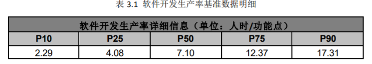

## 软件开发成本度量

本项目使用国标**GB/T 36964-2018 软件开发成本度量**规范进行成本估计。

估算时使用的各类基准数据参照**2019年 中国软件行业基准数据**

使用标准**ISO/IEC 20926:2009 Software and systems engineering — Software measurement — IFPUG functional size measurement method 2009**提出的IFPUG方法进行软件规模度量

### 工作量估算

在本项目中我们使用IFPUG方法进行功能点估算（具体过程参加项目文档**功能点估算**）得出本项目的预计功能点为235.62FP

国标**GB/T 36964-2018**和**2019年 中国软件行业基准数据**中分别提供了两种计算未调整工作量的计算公式，下面我们分别以这两个公式计算相应的UE，并进行交叉验证

#### 国标

使用公式
$$
UE=C×S^α
$$
对未调整工作量进行计算，其中C为生产率，S为软件规模，α为规模调整因子

通过查阅行业基准，我们得到如下生产率基准数据:

由于本项目为数据库项目，较为复杂，同时根据经验，α取值一般不超过1.2，我们取调整因子为1.06

我们分别取25百分位数，50百分位数和75千分位数得到生产率分别为4.08，7.10，12.37计算未调整工作量的最小值，最可能值和最大值

带入公式取值，得到UE结果如下图所示

| 最小值  | 最大值   | 最可能值 |
| ------- | -------- | -------- |
| 1334.15 | 4044.962 | 4233.96  |

之后使用公式
$$
AE=UE\times A\times IL\times L\times T
$$
进行计算调整后工作量，通过分析项目特点，我们对以下调整因子采用如下取值：

| 调整因子              | 取值 |
| --------------------- | ---- |
| 应用领域因子A         | 1.2  |
| 软件完整性级别IL      | 1.7  |
| 开发语言调整因子L     | 1.0  |
| 最大团队规模调整因子T | 1.0  |

得到结果

| 最小值  | 最大值  | 最可能值 |
| ------- | ------- | -------- |
| 2721.67 | 8251.73 | 4736.24  |

#### IFPUG

使用公式
$$
工作量=调整后规模×生产率×软件调整因素×开发调整因素
$$
进行计算

通过分析项目特点，对于软件调整因子，我们得到以下数据

| 软件调整因素         | 类别           | 值   |
| -------------------- | -------------- | ---- |
| 应用领域调整因子     | 系统（数据库） | 1.2  |
| 完整性调整因子       | A              | 1.7  |
| 最大团队规模调整因子 | 普通           | 1.0  |
| 软件调整因素         | 1.2\*1.7\*1.0  | 2.04 |

| 开发调整因素     | 类别                          | 值   |
| ---------------- | ----------------------------- | ---- |
| 开发语言调整因子 | GO语言（C++，JAVA同级别语言） | 1.0  |

因此，由于处在预算阶段，因此调整规模因子选取1.39，根据上述得到的生产率，在估算的前中后阶段分别得到如下工作量估计：

| 最小值  | 最大值  | 最可能值 |
| ------- | ------- | -------- |
| 2725.95 | 8264.69 | 4743.68  |

#### 交叉验证

我们计算在生产率取不同值的偏差值，并计算平均偏差值，得到如下结果：
$$
平均偏差值=\frac{\frac{|2721.67-2725.95|}{2721.67}+\frac{|8251.73-8264.69|}{8251.73}+\frac{|4736.24-4743.68|}{4736.24}}{3}=1.571\times10^{-3}
$$
可以看到，使用两种方法计算得到的工作量接近相等，可以认为估计结果较为准确，最后我们选择使用国标计算得到的未调整工作量进行估算。

### 成本估算

#### 直接人力成本与间接成本估算

本项目采用根据项目平均平均人力成本费率和估算的总工作量直接计算直接人力成本与间接成本之和

在此我们认为每名员工一个月工作21.75天，每天工作8小时，即可将以人时为单位的工作量估计转化为以人月为单位的工作量估计。

为此，我们得到估计工作量上下限分别为15.642p·m和47.424p·m，最可能工作量为27.220p·m。

根据查阅行业基准数据，我们得到上海的基准人月费率为28548元，在本项目中，我们就采取此值作为平均人力成本费率，因此，我们得到直接人力成本与间接成本之和如下表所示：

| 最小值     | 最大值      | 最可能值  |
| ---------- | ----------- | --------- |
| 446547.816 | 1353860.352 | 777076.56 |

#### 直接非人力成本估算

由于在直接非人力成本中，采购相应硬件和相应软件占直接非人力成本的主要部分，因此我们在计算本项目的直接非人力成本仅计算采购费用

##### 硬件费用

由之前的资源分配计划可知，本项目需要的硬件资源为34台工作站与2台服务器以及配套的显示器及键鼠套装，在查询相应后，我们得到以下单价（信息来源：京东商城）：

| 类别                   | 单价/元 |
| ---------------------- | ------- |
| 工作站（Dell T3630)    | 8899    |
| 显示器（HP 27M）       | 849     |
| 键鼠套装（罗技 MK275） | 109     |
| 服务器（Dell T40）     | 5799    |

因此硬件费用总价为
$$
(8899+849+109) \times 34 +5799 \times 2=346736
$$

##### 软件费用

本项目使用GO语言开发，需要配备GO语言IDE，在这里我们选择GoLand作为项目开发使用的IDE，同时考虑到本项目开发周期可能不会超过两年，通过查询官网价格，我们得到购买两年商业许可证共需2533.32元，并且项目组共有34名员工，同时对于每台工作站，需要安装操作系统，在此项目中，我们选择给8位员工的工作站安装Windows系统以及Office办公套件，其余员工分别使用免费Ubuntu系统，其中Windows操作系统1817元，Office办公套件1998元

因此可以得到项目组软件费用为
$$
2533.32 \times 34 + 1817 \times 8 + 1998 \times 8=86132.88
$$

##### 直接非人力成本总计

综上所述，直接非人力成本
$$
DNC=346736+86132.88=432868.88
$$

#### 成本总计

通过上述对直接人力成本，间接成本和直接非人力成本的估算，我们可以得到最终的估算结果，如下表所示

| 最小值    | 最大值     | 最可能值   |
| --------- | ---------- | ---------- |
| 879416.70 | 1786729.23 | 1209945.44‬ |

因此预计软件开发成本的上下限分别为879416.70元和1786729.23元，最有可能的成本为1209945.44‬元