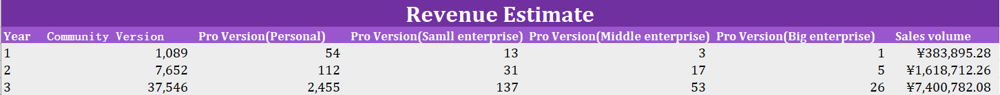
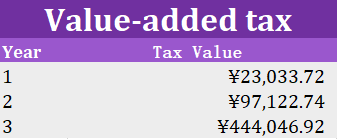
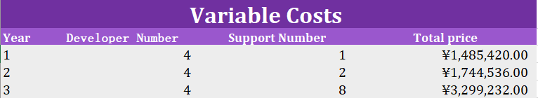
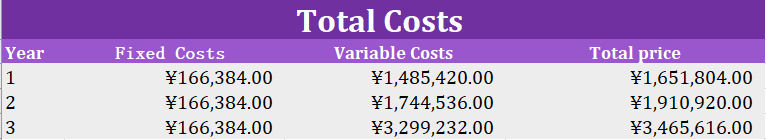

## Operations Plan

### Sales Estimate

Our project is a key-value database project. We not only sell our products to outer customer, but also make the product as the infrastructure for our enterprise and increase the influence. So our goal mainly is get more market share, as for sales volume and profit, the based goal is get profit in any one of three years.

本项目作为key-value数据库除去作为产品对外出售外，也可作为公司内部基本设施以及在业界用于提高公司影响力，因此以抢占市场份额为主，对于销售额以及盈利而言，基本目标是在三年内本项目可达到收支平衡即可。

Because our goal is get more market share, we will compete with many open-source and free key-value database, so we take the strategy that we provide free community version for small enterprise and person customer. So in the beginning, we will get less sales volume. We think our main profit point is selling pro version to middle or big  enterprise  to get profit when we increase the influence.

由于本项目为抢占市场份额，与众多开源免费的Key-value数据库进行竞争，采用对小型企业及个人用户提高免费社区版的策略，因此在发行初期，营业额必然较少。预计主要赢利点为在提升市场影响力后向大中型企业出售专业版软件以取得盈利。

Besides, in recent years, key-value database is more and more popular in database field, there are still more market, and most key-value databases are open-source database, only maintained by users.

同时，近年来，key-value数据库数据库领域越来越受欢迎，存在较大市场等待开拓，但大部分key-value数据库都是开源数据库，由使用者自行进行维护。

We can find that in the key-value database field, the second and the third most popular databases are Amazon DynamoDB and Microsoft Azure Cosmos DB which provide support service. So we are optimistic to the sale of our products in the feature.

通过查询DB-engines网站的数据也可发现，在key-value数据库领域中，除去Redis外，排在第二和第三名的Amazon DynamoDB及Microsoft Azure Cosmos DB都是提供相关维护服务的产品。因此我们对本项目的后续销售情况持乐观态度。

And when we count the revenue, we need deduct the value-added tax, the tax rate of IT enterprise is 6%.

下表为最终3年销售额预测结果

These are three years revenue estimate table. The result has deducted the value-added tax.

And the value-added tax are belows:

### Fixed Operating Costs

A fixed cost is one that does not change with an increase or decrease in sales or productivity and must be paid regardless of the company’s activity or performance. For this instance, we include renting, management fee and sales as the fixed cost. 

* Renting fee mainly indicates the office space renting, which derives form possible company location in Shanghai and corresponding real state prices. 
* Management fee consist of printing fee, communication fee and utility fee. 
* Sales fee are mainly of running fee in sale activity. Details of the fixed costs are listed in the figure below.

Through searching the rent fee of office building in Shanghai. We set the rent fee of office as 148384 yuan per year.

通过查询上海写字楼租金，我们暂定办公场所租金为148384元/年

And we set the manage fee as 6000 yuan per year.

管理费用暂定为6000元/年

Sales fee mainly includes building the sales web page and advertising, so we set the fee as 12000 yuan per year.

销售费用以销售网站搭建以及宣传为主，暂定为12000元/年

So we get the fixed cost that is 166384 yuan per year.

由此我们得到年固定费用为166384元

### Variable Operating Costs 

Unlike fixed costs, variable costs increase as production increases and decrease as production decreases. There are two major kinds variable costs that we pay attention to, listed as salaries and transportation. The salaries are divided into two parts, each stands for software developer or other staff salary. 

* For our project, we decide leave four developer maintaining and updating our project after finishing developing our project.

* 对于本项目来说，在项目开发完成后，我们决定预留4名开发人员进行项目后续的开发维护工作
* Besides, we also leave one support staff providing support service for customers. When revenue has increased by one million yuan, we add one support staff in addition to adapt to business growth.
* 同时，预留一名技术支持对客户提供技术服务，在销售额每增长100万时，额外增加一名技术支持人员以更好适应业务扩展

With searching information, we set the salary of developer is 25548 yuan per month, and the salary of support is 21593 yuan per month(Because the based data including indirect cost, and the fixed cost is invariable in this case. If we use the based data, when the staff number of project has changed, the indirect cost(namely fixed cost in this case) also changed. So we don't choose use the based data in the end)

我们根据查询相关资料，暂定开发人员月薪资为25548/月，技术支持薪资为21593元（由于基准数据包含了间接成本，因此在固定成本一定，项目人员可变时存在一定误差，因此这里不采用基准数据取值）

According the analysis above, we get the information:

跟据上述的成本估计，我们得到以下信息

### Cost Estimation

According the fixed costs and variable costs, we get the cost estimation:

根据上述固定成本和可变成本，我们得到如下成本估计

