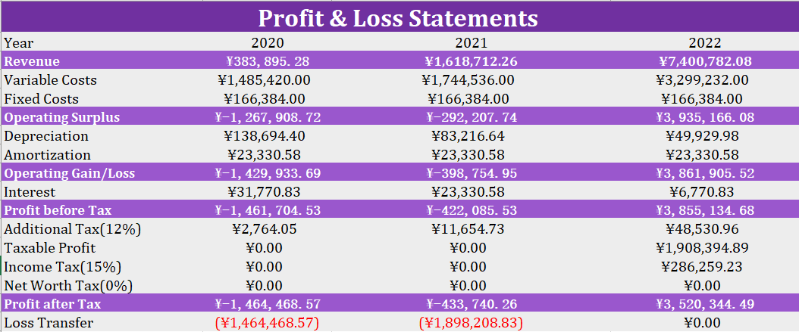

## Business Plan

### Operating Statement Framework

An operating statement, also known as a profit and loss statement or an income statement, is a vital financial statement used by all companies. We make operating statement at each end of the month of the first year and the end of year for the next three years. This statement shows our key-value database system's revenues and expenses and calculates the company's net profit and net loss for each specified period of time. 

The table below indicates the framework of the operating statement. 

Details are listed as the table shows.

Revenue is first retrieved from sales and price. Variable cost, fixed cost and diverse taxes are the put into consideration to get the operating surplus. Then minus the interest so that we have the profit before tax. Four factors within tax are concerned to get the profit after the tax. Especially notice the loss transfer factor, once the year before is not profitable, we use the loss to transfer part of the taxable profit this year. Finally, with divided payments put into consideration, we have our net profit/loss for each year.

### Value-added Tax Calculation

According to the relevant laws, for our IT field, the value-added tax is 6%, and the value-added tax will be calculated when we calculation revenue.

### Income Tax Calculation

According to the relevant provisions of the National Tax Law, the standard tax rate of enterprise income tax is 25%. Small-scale micro-profit enterprises that meet the requirements shall be subject to enterprise income tax at a reduced tax rate of 20%. High and new technology enterprises which are supported by the state, will be levied enterprise income tax at a reduced rate of 15%.

Our project is database project, the field is belonged to high and new technology enterprises which are supported by the state.

So the income tax of our project is 15%

### Additional Tax Calculation

According to the relevant laws, the additional tax is based on the value-added tax, and usually include three part: urban maintenance and construction tax which tax rate usually is 7% in urban, education supplementary tax which tax rate usually is 3% and local education supplementary tax is 2%.

So the total tax rate of additional tax is 12%

### Dividend Payments

The company’s annual general meeting of shareholders passed a dividend distribution plan and allocated dividends for the previous year. According to the profitability of the company, the company began to distribute dividends from the third year. The profit distribution ratio is temporarily set at 20% of the profit available for distribution.

### Profit & Loss Statements 

Based on the analysis mention before, we have drawn detailed profit & loss statement for each year from 2020 to 2022

### Business Plan Report

According to the data above, we can see that our project from loss transform to profit. It means our project achieve one of the goal, survive.

So we can see the sales volume is increasing more. So we can append more investment. And with the number of customers increasing, we need to employ more developers and supports to update our software and provide support services.