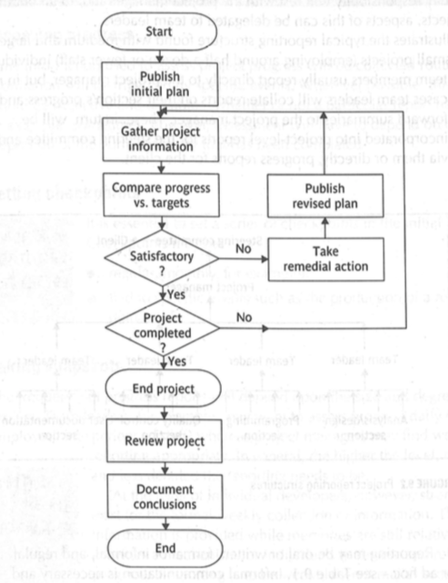
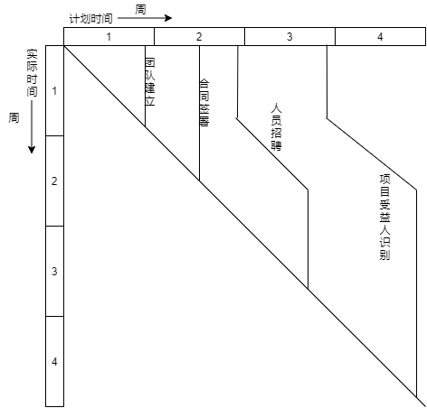

### 2.4 Project Monitoring & Control

#### 2.4.1 Project control cycle

本项目使用螺旋过程模型,将整个项目分为多个螺旋阶段,每个螺旋阶段的控制周期如下图所示

#### 2.4.2 Reporting

本项目主要采用报告的方式对项目的进展进行监督,报告根据用途分为一下几种:

1. 例会:

   * 该报告类型为定期口头正式报告,每周进行一次,并附有正式书面报告

   * 以整个项目组中每个小组为单位进行(如测试组,设计组等)
   * 例会主要对小组负责的部分的进展情况进行讨论

2. 进展报告

   * 该报告类型为定期书面正式报告,每周进行一次
   * 该报告为例会结束后各小组向主管部门提交目前的项目进展
   * 主管部门根据各个小组的进展情况适当调整项目规划

3. 阶段结构评审会

   * 该报告类型为特定口头正式报告,在各个阶段活动完成后召开,并附有正式书面报告
   * 该报告为主管部门与各小组组长一同召开
   * 该报告用于对本阶段项目的进展情况进行总结分析,并提出下一阶段的计划

4. 异常报告

   * 该报告类型为特定书面正式报告,在发生异常情况下提交(如项目资金不足,人员变更等)
   * 管理人员根据报告内容给出相应的解决方案

#### 2.4.3 Visualizing progress

本项目采用时间线对项目进展情况进行可视化描述

下图为项目前四周进展情况示例,其中由于招聘人员存在风险,项目组及时调整了项目计划,使得项目进展要比预期多花费一周时间

#### 2.4.4 Earned value analysis

本项目采用挣值分析法对项目进行成本监督,采用0/100方法进行计算,下表(图)为项目的基线预算计算

<table>
   <tr>
      <td>任务</td>
      <td>预算工作日</td>
      <td>计划完成时间</td>
      <td>累计工作日</td>
      <td>累计挣值(%)</td>
   </tr>
   <tr>
      <td>团队建立</td>
      <td>5</td>
      <td>5</td>
      <td>5</td>
      <td>1.204819277</td>
   </tr>
   <tr>
      <td>合同签署</td>
      <td>3</td>
      <td>8</td>
      <td>8</td>
      <td>1.927710843</td>
   </tr>
   <tr>
      <td>人员招聘</td>
      <td>5</td>
      <td>10</td>
      <td>13</td>
      <td>3.13253012</td>
   </tr>
   <tr>
      <td>项目受益人识别</td>
      <td>5</td>
      <td>15</td>
      <td>18</td>
      <td>4.337349398</td>
   </tr>
   <tr>
      <td>需求沟通</td>
      <td>10</td>
      <td>25</td>
      <td>28</td>
      <td>6.746987952</td>
   </tr>
   <tr>
      <td>需求细化</td>
      <td>10</td>
      <td>35</td>
      <td>38</td>
      <td>9.156626506</td>
   </tr>
   <tr>
      <td>需求评审</td>
      <td>3</td>
      <td>38</td>
      <td>41</td>
      <td>9.879518072</td>
   </tr>
   <tr>
      <td>非功能型需求建模</td>
      <td>14</td>
      <td>52</td>
      <td>55</td>
      <td>13.25301205</td>
   </tr>
   <tr>
      <td>功能型需求建模</td>
      <td>21</td>
      <td>59</td>
      <td>76</td>
      <td>18.31325301</td>
   </tr>
   <tr>
      <td>需求建模评审</td>
      <td>5</td>
      <td>64</td>
      <td>81</td>
      <td>19.51807229</td>
   </tr>
   <tr>
      <td>算法构思设计</td>
      <td>10</td>
      <td>74</td>
      <td>91</td>
      <td>21.92771084</td>
   </tr>
   <tr>
      <td>系统架构设计</td>
      <td>12</td>
      <td>76</td>
      <td>103</td>
      <td>24.81927711</td>
   </tr>
   <tr>
      <td>模块划分</td>
      <td>14</td>
      <td>78</td>
      <td>117</td>
      <td>28.19277108</td>
   </tr>
   <tr>
      <td>接口设计</td>
      <td>14</td>
      <td>92</td>
      <td>131</td>
      <td>31.56626506</td>
   </tr>
   <tr>
      <td>概要设计评审</td>
      <td>7</td>
      <td>99</td>
      <td>140</td>
      <td>33.73493976</td>
   </tr>
   <tr>
      <td>算法详细设计</td>
      <td>14</td>
      <td>113</td>
      <td>154</td>
      <td>37.10843373</td>
   </tr>
   <tr>
      <td>组件详细设计</td>
      <td>21</td>
      <td>120</td>
      <td rowspan="2">196</td>
      <td rowspan="2">47.22891566</td>
   </tr>
   <tr>
      <td>模块详细设计</td>
      <td>21</td>
      <td>120</td>
   </tr>
   <tr>
      <td>原型设计</td>
      <td>14</td>
      <td>134</td>
      <td>210</td>
      <td>50.60240964</td>
   </tr>
   <tr>
      <td>详细设计评审</td>
      <td>7</td>
      <td>141</td>
      <td>217</td>
      <td>52.28915663</td>
   </tr>
   <tr>
      <td>环境搭建</td>
      <td>4</td>
      <td>145</td>
      <td>221</td>
      <td>53.25301205</td>
   </tr>
   <tr>
      <td>命令执行器模块编码</td>
      <td>18</td>
      <td>163</td>
      <td>239</td>
      <td>57.59036145</td>
   </tr>
   <tr>
      <td>通信模块编码</td>
      <td>21</td>
      <td>166</td>
      <td>260</td>
      <td>62.65060241</td>
   </tr>
   <tr>
      <td>内存存储模块编码</td>
      <td>28</td>
      <td>173</td>
      <td rowspan="2">316</td>
      <td rowspan="2">76.14457831</td>
   </tr>
   <tr>
      <td>数据持久化模块编码</td>
      <td>28</td>
      <td>173</td>
   </tr>
   <tr>
      <td>统计模块编码</td>
      <td>14</td>
      <td>187</td>
      <td>330</td>
      <td>79.51807229</td>
   </tr>
   <tr>
      <td>单元测试</td>
      <td>14</td>
      <td>201</td>
      <td>344</td>
      <td>82.89156627</td>
   </tr>
   <tr>
      <td>集成测试</td>
      <td>7</td>
      <td>208</td>
      <td>351</td>
      <td>84.57831325</td>
   </tr>
   <tr>
      <td>系统测试</td>
      <td>7</td>
      <td>215</td>
      <td>358</td>
      <td>86.26506024</td>
   </tr>
   <tr>
      <td>验收测试</td>
      <td>7</td>
      <td>222</td>
      <td>365</td>
      <td>87.95180723</td>
   </tr>
   <tr>
      <td>测试评审</td>
      <td>5</td>
      <td>227</td>
      <td>370</td>
      <td>89.15662651</td>
   </tr>
   <tr>
      <td>项目部署</td>
      <td>7</td>
      <td>234</td>
      <td>377</td>
      <td>90.84337349</td>
   </tr>
   <tr>
      <td>用户训练</td>
      <td>21</td>
      <td>237</td>
      <td>387</td>
      <td>93.25301205</td>
   </tr>
   <tr>
      <td>用户手册编写</td>
      <td>21</td>
      <td>248</td>
      <td>408</td>
      <td>98.31325301</td>
   </tr>
   <tr>
      <td>验收成果</td>
      <td>7</td>
      <td>255</td>
      <td>415</td>
      <td>100</td>
   </tr>
</table>

