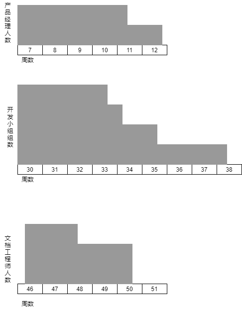

### Resources allocation

#### Resources list

本项目预计所需主要资源列表如下所示

* 劳动力资源

| 名称         | 职能                                                         | 数量 |
| ------------ | ------------------------------------------------------------ | ---- |
| 人事         | 负责项目前期的人员招聘                                       | 2人  |
| 项目经理     | 主管整个项目运作                                             | 1人  |
| 产品经理     | 负责分析和获取项目需求                                       | 2人  |
| 系统架构师   | 对整个系统进行架构设计                                       | 2人  |
| 算法设计小组 | 设计项目所使用的算法 一个小组由1位算法科学家,2位算法工程师,1位小组长组成 | 1组  |
| 开发小组     | 负责项目的编码工作 一个小组由1位小组长和4位程序员组成   | 3组  |
| 测试小组     | 负责软件的测试工作 由1位小组长和3名测试人员组成         | 1组  |
| 文档工程师   | 负责撰写用户手册                                             | 3人  |
| 运营维护     | 负责项目部署                                                 | 1人  |

* 设备资源

| 名称   | 职能                 | 数量 |
| ------ | -------------------- | ---- |
| 工作站 | 通过项目开发环境     | 34   |
| 服务器 | 提供实际产品运行环境 | 2    |

各阶段活动所需资源如下表所示:

| 阶段 | 活动     | 资源             | 天数 | 数量 | 备注               |
| ---- | -------- | ---------------- | ---- | ---- | ------------------ |
| ALL  |          | 项目经理         | 255  | 1    |                    |
| 1    | ALL      | 工作站           |      | 2    | 为每位员工提供一台 |
|      | God/P/1  | 人事             | 5    | 1    |                    |
|      | God/P/2  | 人事             | 5    | 1    |                    |
|      | God/P/3  | 人事             | 3    | 1    |                    |
| 2    | ALL      | 工作站           |      | 5    |                    |
|      | God/R/1  | 产品经理         | 5    | 2    |                    |
|      | God/R/2  | 产品经理         | 10   | 2    |                    |
|      | God/R/3  | 产品经理         | 3    | 2    |                    |
|      | God/R/4  | 产品经理         | 3    | 2    |                    |
|      |          | 系统架构师       | 3    | 2    |                    |
|      |          | 算法设计小组组长 | 3    | 1    |                    |
|      | God/Rm/1 | 产品经理         | 21   | 1    |                    |
|      | God/Rm/2 | 产品经理         | 14   | 1    |                    |
|      | God/Rm/3 | 产品经理         | 5    | 2    |                    |
|      |          | 系统架构师       | 5    | 2    |                    |
|      |          | 算法设计小组组长 | 5    | 1    |                    |
| 3    | ALL      | 工作站           |      | 9    |                    |
|      | God/H/1  | 系统架构师       | 12   | 1    |                    |
|      | God/H/2  | 系统架构师       | 14   | 1    |                    |
|      | God/H/3  | 算法设计小组     | 10   | 1    |                    |
|      | God/H/4  | 系统架构师       | 14   | 2    |                    |
|      |          | 开发小组组长     | 14   | 3    |                    |
|      | God/H/5  | 系统架构师       | 7    | 2    |                    |
|      |          | 开发小组组长     | 7    | 4    |                    |
| 4    | ALL      | 工作站           |      | 14   |                    |
|      | God/D/1  | 系统架构师       | 21   | 1    |                    |
|      | God/D/2  | 系统架构师       | 21   | 1    |                    |
|      | God/D/3  | 算法设计小组     | 14   | 1    |                    |
|      | God/D/4  | 算法设计小组     | 14   | 1    |                    |
|      |          | 开发小组         | 14   | 1    |                    |
|      | God/D/5  | 系统架构师       | 7    | 2    |                    |
|      |          | 开发小组组长     | 7    | 4    |                    |
| 5    | ALL      | 工作站           |      | 16   |                    |
|      | God/C/1  | 运营维护         | 4    | 1    |                    |
|      | God/C/2  | 开发小组         | 21   | 1    |                    |
|      | God/C/3  | 开发小组         | 28   | 1    |                    |
|      | God/C/4  | 开发小组         | 28   | 1    |                    |
|      | God/C/5  | 开发小组         | 18   | 1    |  |
|  | God/C/5  | 开发小组         | 14   | 1    |                    |
| 6    | ALL      | 工作站           |      | 4   |                    |
|  |  | 服务器 | | 1 | |
|      | God/T/1  | 测试小组 | 14 | 1 |                    |
|      | God/T/2 | 测试小组 | 7 | 1 |                    |
|      | God/T/3 | 测试小组 | 7 | 1 |                    |
|      | God/T/4 | 测试小组 | 7 | 1 |                    |
| | God/T/5 | 测试小组 | 7 | 1 | |
| 7 | ALL | 工作站 |  | 4 | |
|  |  | 服务器 |  | 1 | |
|  | God/A/1 | 运营维护 | 7 | 1 | |
|  | God/A/2 | 文档工程师 | 21 | 2 | |
|  | God/A/3 | 文档工程师 | 10 | 1 | |
|  | God/A/4 | 产品经理 | 7 | 2 | |

#### Resources scheduling

通过人员资源直方图,我们可以发现部分资源在空闲时仍可以加以利用,对于这种情况,若将空闲资源投入到需要该资源的活动中,在一定程度上可以加快项目进度,下面我们来分析一下这种调度方式的可行性

上图分别为产品经理,开发小组,文档工程师三种资源的资源直方图,下面来根据活动特点一一对其资源调度方式进行分析

* 产品经理
  * 图示直方图体现了功能型需求建模和非功能型需求建模两个并行进行的活动执行过程中所需的产品经理资源情况
  * 由于非功能型需求建模较早完成,故存在空闲的产品经理可投入于功能型需求建模
  * 但考虑到功能型需求建模此时预计已进行了2/3,中途加入新人员会带来额外的沟通成本
  * 同时考虑到需预留出缓冲期,因此在此时进行资源调度未必能带来理想的收益
  * 故对于此资源不再另行调度资源
* 开发小组
  * 图示直方图体现了进行各个模块开发时开发小组的资源投入情况
  * 对于并行进行的四个模块开发,与对产品经理资源的分析类似,考虑到附加成本和缓冲期,不另行进行资源调度
  * 而对于统计模块的开发,由于开发开始时其余开发小组就处于空闲状态,投入空闲的开发小组带来的沟通成本较低,但能较大提高开发效率,同时由于该模块依赖于前四个模块的开发,因此该模块开始开发时,其余开发小组必然处于空闲状态
  * 因此对于此资源,可在统计模块开发时额外投入空闲的开发小组以加快开发速率
* 文档工程师
  * 图示直方图体现了文档工程师在阶段7的资源需求情况
  * 如图所示,在完成活动用户培训后,有一位文档工程师处于空闲状态
  * 同时,用户手册可划分出多个较低耦合的子部分,因此在项目中期增加人员造成的额外沟通成本是可以接受的
  * 因此在完成用户培训活动后,可将空闲的文档工程师投入攥写用户文档这一活动中