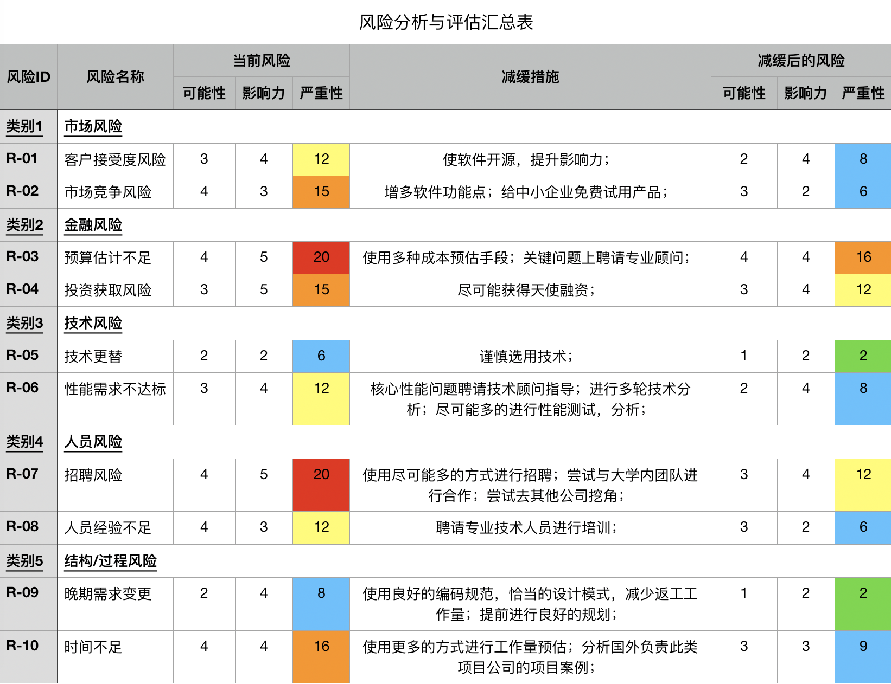
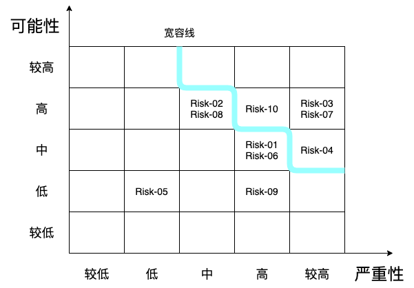
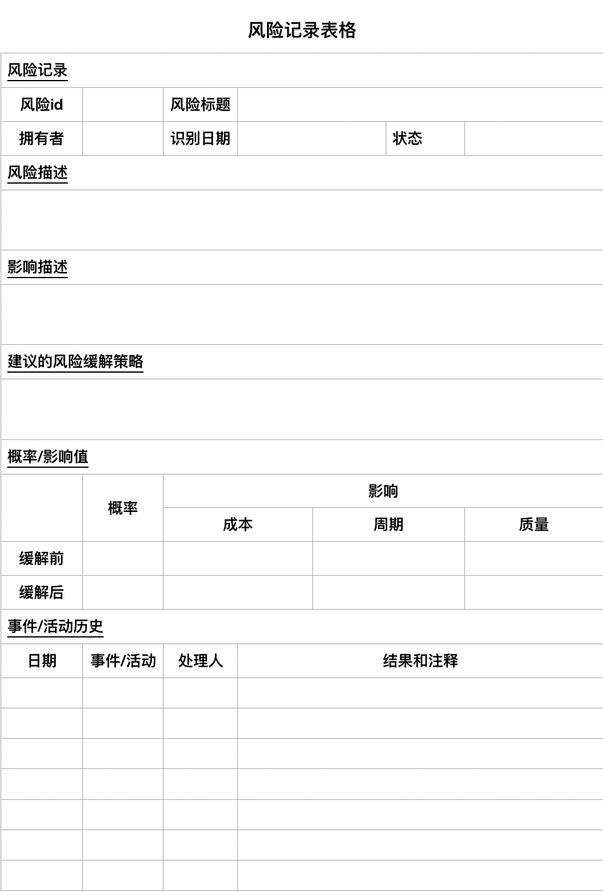

# SSE Software Project Management

### Godis key-value Distributed In-memory Database

## 1. Business Case

### 1.1 Executive Summary

#### 1.1.1 Problem/Opportunity

项目的机会在于国内的制作基础设施架构应用的公司并不多，大多数互联网公司，传统行业公司采用的缓存系统大多数为国外企业的分布式key-value内存缓存数据库，如memcached，redis等，而国内在该产业几乎是空白。我司有机会开发一款核心技术为自主研发的分布式key-value缓存内存数据库，并能够在市场上取得一定的占有率。

#### 1.1.2 Organization’s Goal & Strategy

企业的短期目标是通过该项目的发布在市场上取得一定的占有率，提升该产品在基础架构级软件行业的影响力，从而提升企业在该领域的影响力，并能够使公司取得盈利。企业的战略目标在于通过该产品在市场上的高占有率，能够回收大部分成本，并上市融资，在技术领域上，提升中国在kv数据库这一领域上的话语权，填补中国基础软件行业的空白，提升民族软件形象。

#### 1.1.3 MOV & Its Impact

该商业项目的Measurable Organizational Value(MOV)为在市场上取得更高的占有率，在6个月内，使国内至少5家企业使用我司的产品。1年内，50家中小企业使用，5家大型企业使用我司的产品。在2年内，100家中小企业使用，20家大型企业使用，国外有20家企业使用。实现该MOV能够在市场影响力上和财政上对企业有非常大的提升。只有实现了MOV中提及的目标，企业的成本才能收回，影响力才能提升，才能实现盈利。

#### 1.1.4 Alternatives/Options

企业目前有四种项目可选方案，分别为企业内部全权负责开发该项目的全部内容；企业开发核心模块，外包其余模块；企业购买现有开源产品，在其基础上进行二次开发；企业放弃该项目。

### 1.2 Business Case Analyse Team

| 角色         | 职责                        |
| ------------ | --------------------------- |
| 执行赞助商   | 提供该项目的执行支持        |
| 技术支持人员 | 提供该项目的技术指导/支持   |
| 过程改进人员 | 对项目的过程改善提出建议    |
| 项目经理     | 管理Business Case和项目团队 |
| 风险控制人员 | 为项目提供风险分析          |

### 1.3 Introduction

#### 1.3.1 Background

近些年来，随着4g的普及以及5g的出现，对于网络请求响应速度的需求日益提升，而内存key-value成为了所有互联网公司必须使用的缓存中间件。该项目由的商业目标是为所有需要使用到web技术的公司和组织，提供一个高速的，高并发的，分布式的内存缓存解决方案。当今时代，人们对于实时性访问需求越来越高，内存级别的数据缓存作为一级缓存可以极大地提升访问速度，提高响应比，是每个公司都需要使用的技术，前景很好。同时，目前世界上的大部分公司都在使用国外开源的内存kv数据库，如redis，memcached等产品，中国目前现有的内存kv数据库并未在国际上得到广泛认可，所以该项目承载着希望，能够成为中国内存kv数据库领域的领头羊，并未现有内存key-value数据库

#### 1.3.2 Current Situation and Problem/Opportunity Statement

项目的机会在于国内的制作基础设施架构应用的公司并不多，大多数互联网公司，传统行业公司采用的缓存系统大多数为国外企业的kv数据库，而国内在该产业几乎是空白。公司希望能够开发全世界流行的新一代内存缓存数据库中间件，先打通国内市场，再进一步打开国外市场，为民族软件行业争光，成为中国，乃至世界在该领域的领头羊。

项目目前处于起步阶段，所存在的问题大多局限于人员方面。公司难以招聘到开发底层系统的编码人员，目前招聘大多数都是应用层面开发人员居多，从而导致了招聘的困难。同时由于项目的是属于基础架构级别项目，而非应用级别项目，在获取融资方面比较困难。项目所拥有的机会在于，首先，若能获取高额融资，需要招聘到有经验的底层开发人员，如从apache，oracle等公司挖角，其次，当项目在完成数次迭代后，能够率先提供给某些企业或政府免费试用以及使用培训，从而建立起产品口碑，能够获得快速扩张使用的机会。

#### 1.3.3 Measurable Organizational Value (MOV)

使用时间线表格来记录MOV内容

| 时间线 | MOV                                                          |
| :----- | ------------------------------------------------------------ |
| 6个月  | 在国内有5家中小企业使用我司产品作为kv数据库                  |
| 1年    | 在国内有50家中小企业，5家大型企业使用我司产品作为kv数据库    |
| 2年    | 在国内有100家中小企业，20家大型企业使用我司产品作为kv数据库，在国外有20家企业使用我司产品作为kv数据库 |

#### 1.3.4 How achieving the project’s MOV will support the organization’s goal and strategy

实现MOV中包含的目标在各个方面都能帮助企业实现企业的目标以及战略。企业首要目标是将我司产品成功的开发出来，并推广向市场，提升企业在国际上的影响力。在两年内能够达到国内100家中小企业，20家大型企业使用我司产品作为kv数据库，且在国外有20家企业使用我司产品作为kv数据库，这毫无疑问会使企业成为该领域的新星，让企业的影响力得到显著的提升。企业的下一目标即为盈利，毫无疑问，当该项目在市场上取得较高的占有率时，会吸引越来越多的企业使用我司的产品，而作为一款几乎每个使用到web技术的公司都必备的基础架构级别的设施，其他企业使用我司产品的机会是很大的，所以盈利是当企业占有率提升到较高水平后的必然情况。该项目的战略目标包括持续性的吸纳如今已有的缓存技术的优点，并持续增强与各类web框架集成的能力，最终达到提高市场占有率的目的。从开发人员角度来说，希望该产品能够进一步提高数据提取响应速度，增强数据稳定性，并支持各类分布式事务，并有野心从中间件的身份脱离出，能够成为独立的数据库，进一步打开市场，进一步提升中国软件行业在国际上的地位。从公司角度来说希望该产品能够提升公司品牌的知名度，从而吸纳更多资金投入我司，更多人才加入我司，从而不仅仅提升我司的经济效益水平，还能提升品牌效益，以便于后期开发更多底层基础架构级别应用，底层中间件，从而达到良性循环，占有更多世界市场。

#### 1.3.5 Objectives of Writing this Business Case

编写该商业案例分析的目的在于为当前所分析得到的商业机会提供一个便捷参考，以及对项目MOV进行具体的阐述，以及对我司可执行的项目提供各种可选方案，以及对他们的具体分析，包括方案的经济效益分析，可行性分析，风险控制分析等。

### 1.4 Alternatives

#### 1.4.1 Alternative One (base case)

| 概述 | 企业内部全权开发此项目的全部内容                             |
| ---- | ------------------------------------------------------------ |
| 描述 | 企业通过自己建立项目团队，包括招聘足够的开发人员，设计人员，测试人员，项目管理人员，市场分析人员，营销人员，销售人员等，开发项目的全部内容，包括核心存储引擎，通信模块，高并发性能优化算法模块，UI模块，以及项目的需求，设计文档，用户使用文档，手册。同时包括营销人员使用的微信公众号后台，项目官方网站等。 |

#### 1.4.2 Alternative Two

| 概述 | 企业开发核心模块，部分模块外包                               |
| ---- | ------------------------------------------------------------ |
| 描述 | 企业自己建立项目团队，包括招聘足够的开发人员，设计人员，测试人员，项目管理人员，市场分析人员，营销人员，销售人员等，开发该项目中核心的模块，包括存储引擎，通信模块，高并发性能优化算法模块。但是公司将其余如UI模块，用户使用文档，手册，以及营销人员使用的微信公众号后台，项目官方网站外包给其他小公司。 |

#### 1.4.3 Alternative Three

| 概述 | 购买现存的开源kv数据库，在其基础上二次开发                   |
| ---- | ------------------------------------------------------------ |
| 描述 | 企业自己建立项目团队，包括招聘足够的开发人员，设计人员，测试人员，项目管理人员，市场分析人员，营销人员，销售人员等，首先让开发和设计人员通过技术商讨，选择一个国际上开源的kv数据库项目，与其所属公司或组织进行联系，并进行购买，在其基础上对其进行二次开发，改进，使其在功能上更符合我司的要求，在性能上有较大幅度的提升。之后再进行UI模块的编写，也包括UI模块，以及项目的需求，设计文档，用户使用文档，手册。同时包括营销人员使用的微信公众号后台，项目官方网站等。 |

#### 1.4.4 Alternative Four

| 概述 | 放弃该项目                               |
| ---- | ---------------------------------------- |
| 描述 | 企业可以选择放弃该商业机会，不做任何事。 |

### 1.5 Alternative Analysis

//TODO

## 2 Project Beneficiaries

#### 2.1 Responsibility Matrix

| 岗位                 | 职责                       |
| -------------------- | -------------------------- |
| **项目经理**         | 认定项目范围和目标         |
|                      | 认定项目干系人             |
|                      | 认定项目基础设施           |
|                      | 分析项目特征               |
|                      | 编写project charter        |
|                      | 举办项目启动会议           |
|                      | 评审并最终确定甘特图       |
|                      | 评审并推广项目计划         |
|                      | 执行调查                   |
|                      | 项目收益测度               |
|                      | 项目质量管理               |
|                      | 项目风险管理               |
|                      | 项目资源管理               |
|                      | 人力资源管理               |
|                      | 与客户沟通                 |
|                      | 进度报告                   |
|                      | 准备项目结项报告           |
|                      | 准备项目结项演讲           |
|                      | 训练其他管理员工           |
|                      | 用户培训                   |
| **产品经理**         | 分析项目特征               |
|                      | 认证项目产品及活动         |
|                      | 需求分析                   |
|                      | 制定产品方案               |
|                      | 编写产品说明文档           |
|                      | 编写产品需求分析文档       |
|                      | 评估每个活动工作量         |
|                      | 创建WBS图                  |
|                      | 创建甘特图                 |
|                      | 资源分配                   |
|                      | 挣值分析                   |
|                      | 领导设计团队               |
|                      | 管理开发，测试团队         |
|                      | 金融计划                   |
| **人力资源管理人员** | 建立人力资源管理系统       |
|                      | 制定人力资源计划           |
|                      | 管理企业人才库             |
|                      | 编写职务说明书             |
|                      | 协助管理薪酬方案制定       |
|                      |                            |
| **系统架构师**       | 确认需求与拆分系统         |
|                      | 协助项目经理制定项目计划   |
|                      | 协助项目经理控制项目进度   |
|                      | 技术选型                   |
|                      | 负责系统概要设计           |
|                      | 负责系统详细设计           |
|                      | 领导开发人员进行编码       |
|                      | 领导用户使用文档编写       |
| **算法工程师**       | 负责项目算法设计           |
|                      | 负责已有系统算法分析与改进 |
|                      | 负责算法实现               |
|                      | 协助编写详细设计文档       |
| **研发工程师**       | 负责项目编码实现           |
|                      | 协助编写文档               |
|                      | 系统改进与维护             |
| **测试工程师**       | 负责对项目整体进行测试     |
|                      | 负责集成测试，系统测试     |
|                      | 编写测试报告               |
|                      | 验收测试                   |
|                      | 管控代码质量               |
| **风险管理经理**     | 风险的识别                 |
|                      | 风险分析与优先级排布       |
|                      | 制定风险管理计划           |
|                      | 风险实时管理与控制         |
|                      | 风险缓解                   |
| **文档工程师**       | 负责编写用户使用文档       |
|                      | 编写用户培训手册           |
|                      | 制定项目官网内容           |
| **运维工程师**       | 负责项目部署               |
|                      | 帮助客户解决运行时问题     |
|                      | 维护现有系统的正常运行     |

#### 2.2 Personal Managment

| 岗位         | 人数 |
| ------------ | ---- |
| HR           | 2    |
| 项目经理     | 1    |
| 产品经理     | 2    |
| 风险管理经理 | 2    |
| 系统架构师   | 2    |
| 算法工程师   | 4    |
| 研发工程师   | 20   |
| 测试工程师   | 4    |
| 文档工程师   | 3    |
| 运维工程师   | 1    |

## 3 Project Management Plan

### 3.1 Project Activities and work plan

#### 3.1.1 WBS

#### 3.1.2 Project Charter

#### 3.1.3 Resource Allocation

#### 3.1.3 Gantt

#### 3.1.4 Critical Path

### 3.2 Risk managment

#### 3.2.1 Risk Identification

基于调查和研究，使用检查单和头脑风暴的方法，我们主要讨论出10种可能会发生的风险

##### Market Risk

- 客户接受度风险

  其他的现有公司可能不愿意花费精力来更新他们现有的缓存系统，因为他们担心可能存在的风险性。由于任何一个公司在更新基础设施时会保持非常理性的态度，所以已经拥有一个庞大系统的公司很大程度上不愿意拥抱新技术，拥抱新的变化。这对于我们的项目是一个比较大的风险，因为我们很有可能只能将产品使用于一些初创的小企业中，而这样做对于公司的影响力提升有限，难以得到良好的推广。

- 市场竞争风险

  现在市面上已经有一些主流的内存kv数据库存在，并且应用很广泛，如redis和memcached等外国公司开发的产品，市场竞争压力较大。现存的大多数互联网公司使用redis作为数据库的二级缓存，使用memcached作为LRU缓存，这两个产品均已是较为成熟的产品，拥有较大的供给需求。

##### Financial Risk

- 预算估计不足

  软件开发过程与费用管理是形影不离的。开发花销，管理开销，设备的开销等。一旦某些开销比预期要高，可能会造成整个项目停止。由于开发此类项目的公司较少，我们不易获得类似的费用控制经验，从而可能造成此类的风险。

- 投资获取风险

  项目存在融资困难的风险。由于本项目为基础架构性项目，而非应用级别项目，所以落地后无法立刻变现，这也就导致了融资的困难。投资人会认为该项目风险比较高，项目变现困难。所以公司应尽可能吸引天使投资。

##### Technology Risk

- 技术更替

  在项目开发的途中，我们有可能遇到其他更新的技术手段，从而导致前有的设计失效的情况，或者导致现有设计不足以使产品达到较高性能，从而降低了竞争力。

- 性能需求不足

  由于该项目所需技术较为尖端，所以在前期的迭代中，项目的并发性能可能无法达到既定需求，从而无法满足客户需要。

##### People Risk

- 招聘风险

  由于尖端底层架构开发人员的稀缺性，公司很难招聘到合乎要求的工程师，这也就造成了开发人员短缺的风险。同时有用类似项目管理经验，金融分析经验的人员同样是稀缺资源，所以公司面临各方面的人员招聘风险。

- 人员经验不足

  由于现有的开发人员很有可能面临经验不足的情况，软件质量有难以得到保障的风险。项目管理团队同样面临着经验不足的风险，由于需要和各类企业，如国有企业，中小企业进行商讨，会需要一些具有经验的商业团队，而经验不足的团队很容易使得产品腹死胎中。

##### Structure/Process Risk

- 晚期的需求变更

  需求变更最好处于项目的初期。需求在分析阶段被确定。而在后面的阶段，项目有可能在进行开发途中遭受需求变更，而导致开发计划收到挫折的风险，而有可能造成没有预期到的费用超支，还有可能导致工期延后，使得整个项目迭代周期推迟。

- 时间不足

  项目的时间估计在项目开始的初期是十分难以解决的问题，而且由于缺乏相关开发底层基础架构级别项目经验的项目管理团队，很有可能造成的局面是项目的预估迭代周期与实际大相径庭，从而造成约定好的雇佣时间变得不可靠，从而会造成各类问题，如人员的开销问题，资金的周转问题，资源不足，资源分配不均衡等问题。

#### 3.2.2 Risk Analysis

##### 风险可能性等级

| Level | 可能性等级 | 等级定义 | 描述         |
| ----- | ---------- | -------- | ------------ |
| 5     | >80%       | 较高     | 很可能发生   |
| 4     | 61%~80%    | 高       | 有可能发生   |
| 3     | 41%~60%    | 中       | 不确定       |
| 2     | 21%~40%    | 低       | 较稀少       |
| 1     | 0%~20%     | 较低     | 基本不会发生 |

##### 风险严重性等级

| Level | Description  | 描述             |
| ----- | ------------ | ---------------- |
| 5     | 使得项目失败 | 使得整个项目失败 |
| 4     | 严重         | 对项目造成伤害   |
| 3     | 中等         | 给项目带来麻烦   |
| 2     | 较轻         | 影响项目进展     |
| 1     | 轻微         | 基本没有影响     |

##### 风险等级确定方法

$$
风险 = 风险可能性级别 \times 风险严重性级别
$$

##### 风险风险及评估摘要

##### 可能性/严重性矩阵

根据该矩阵，我们选出四个最重要的风险：

- 时间不足
- 预算估计不足
- 招聘风险
- 投资获取风险

#### 3.2.3 定性分析

##### Market Risk

- 客户接受度风险

  - 分析

    其他的现有公司可能不愿意花费精力来更新他们现有的缓存系统，因为他们担心可能存在的风险性。由于任何一个公司在更新基础设施时会保持非常理性的态度，所以已经拥有一个庞大系统的公司很大程度上不愿意拥抱新技术，拥抱新的变化。这对于我们的项目是一个比较大的风险，因为我们很有可能只能将产品使用于一些初创的小企业中，而这样做对于公司的影响力提升有限，难以得到良好的推广。

  - 短期解决方案

    将我们的产品开源到各大代码托管网站上，建立具有良好推广效果的官方网站，编写易于学习的使用文档，从而提升项目影响力，

- 市场竞争风险

  - 分析

    现在市面上已经有一些主流的内存kv数据库存在，并且应用很广泛，如redis和memcached等外国公司开发的产品，市场竞争压力较大。现存的大多数互联网公司使用redis作为数据库的二级缓存，使用memcached作为LRU缓存，这两个产品均已是较为成熟的产品，拥有较大的供给需求。

  - 短期解决方案

    我们可以在现有方案的基础上，增加其他市面上kv数据库所不含有的功能，以期望提高市场影响力。同时，我们可以给某些初创企业，或中小企业提供免费产品服务，并提供全套使用帮助，以提高竞争力。从而提升产品在行业内的口碑。

##### Financial Risk

- 预算估计不足

  - 分析

    软件开发过程与费用管理是形影不离的。开发花销，管理开销，设备的开销等。一旦某些开销比预期要高，可能会造成整个项目停止。由于开发此类项目的公司较少，我们不易获得类似的费用控制经验，从而可能造成此类的风险。

  - 短期解决方案

    尽可能使用多种方案来评估预算。理性的估计现有的资源。在关键的预算估计问题上可以聘请专业顾问进行指导。

- 投资获取风险

  - 分析

    项目存在融资困难的风险。由于本项目为基础架构性项目，而非应用级别项目，所以落地后无法立刻变现，这也就导致了融资的困难。投资人会认为该项目风险比较高，项目变现困难。

  - 短期解决方案

    尝试获取天使轮融资，以减轻资金压力。尝试与其他大学内部实验室进行合作，尽力减免开支。

##### Technology Risk

- 技术更替

  - 分析

    在项目开发的途中，我们有可能遇到其他更新的技术手段，从而导致前有的设计失效的情况，或者导致现有设计不足以使产品达到较高性能，从而降低了竞争力。

  - 短期解决方案

    尽可能地选用扩展性良好的技术栈，谨慎地选择使用的技术栈。

- 性能需求不足

  - 分析

    由于该项目所需技术较为尖端，所以在前期的迭代中，项目的并发性能可能无法达到既定需求，从而无法满足客户需要。

  - 短期解决方案

    开发人员和设计人员需要进行多轮技术分析，了解技术选型内幕。尽可能多的进行性能测试。在关键性能问题上，尽可能聘请技术专家来进行指导。

##### People Risk

- 招聘风险

  - 分析

    由于尖端底层架构开发人员的稀缺性，公司很难招聘到合乎要求的工程师，这也就造成了开发人员短缺的风险。同时有用类似项目管理经验，金融分析经验的人员同样是稀缺资源，所以公司面临各方面的人员招聘风险。

  - 短期解决方案

    使用尽可能多的方式进行招聘，如从各种不同的招聘网站展开招聘，使用猎头进行挖角等。并且公司应尝试与大学内部的尖端实验室团队展开合作。

- 人员经验不足

  - 分析

    由于现有的开发人员很有可能面临经验不足的情况，软件质量有难以得到保障的风险。项目管理团队同样面临着经验不足的风险，由于需要和各类企业，如国有企业，中小企业进行商讨，会需要一些具有经验的商业团队，而经验不足的团队很容易使得产品腹死胎中。

  - 短期解决方案

    尝试招聘少量的具有丰富经验的资深开发人员，以及某些技术专家，在公司内部展开经验分享，技术培训。聘请少数技术专家作为技术顾问，指导公司员工进行开发。

##### Structure/Process Risk

- 晚期的需求变更

  - 分析

    需求变更最好处于项目的初期。需求在分析阶段被确定。而在后面的阶段，项目有可能在进行开发途中遭受需求变更，而导致开发计划收到挫折的风险，而有可能造成没有预期到的费用超支，还有可能导致工期延后，使得整个项目迭代周期推迟。

  - 短期解决方案

    风险的解决方法在于设计人员应使用良好的设计方案，编码人员编码中尽量多的使用合适的设计模式，以及尽可能多的使用go语言的面向接口编程思想进行编程，使得Godis拥有良好的可扩展性。

- 时间不足

  - 分析

    项目的时间估计在项目开始的初期是十分难以解决的问题，而且由于缺乏相关开发底层基础架构级别项目经验的项目管理团队，很有可能造成的局面是项目的预估迭代周期与实际大相径庭，从而造成约定好的雇佣时间变得不可靠，从而会造成各类问题，如人员的开销问题，资金的周转问题，资源不足，资源分配不均衡等问题。

  - 短期解决方案

    公司的管理团队应该尝试使用更多的方式进行工作量预估，并且应该尽可能的去搜索国外现有公司的以往项目案例，来进行商业评估分析，工作量分析等，来获取经验。

#### 3.2.4 Risk Management Plan

使用风险缓解效率公式来制定风险管理的计划：
$$
RRL = \frac{Risk\space Exposure\space Before - Risk\space Exposure\space After}{Cost\space of\space Risk\space Reduction}
$$

##### 策略

将RRL大于等于1.40的风险采取Risk Reduction的策略进行处理，RRL低于1.40者根据定性分析情况，尽可能采取合理的措施。

根据以上表格，我们主要需要对以下6类风险进行管理记录

1. 用户接受度风险
2. 预算估计不足
3. 技术更替
4. 人员经验不足
5. 晚期需求变更
6. 时间不足

使用风险记录表的方式在项目进展过程中监控和跟踪风险的状况。

使用以下表格进行记录：

这里以**晚期需求变更**风险为例，分析如何记录并跟踪风险。

### 3.3 Project Monitoring & Control

