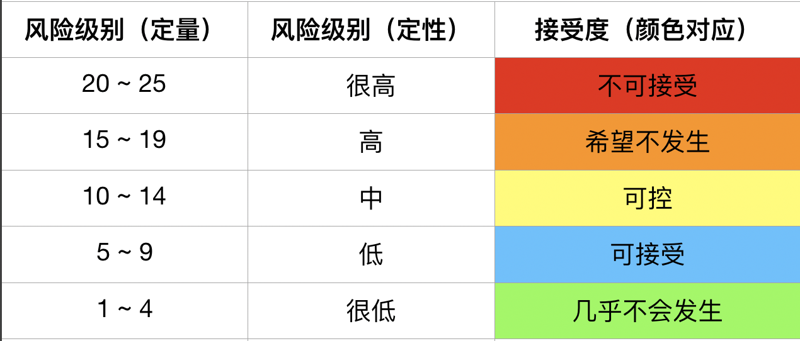
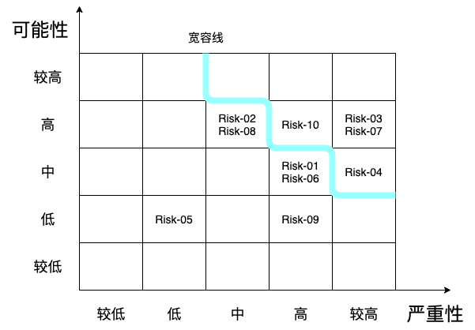
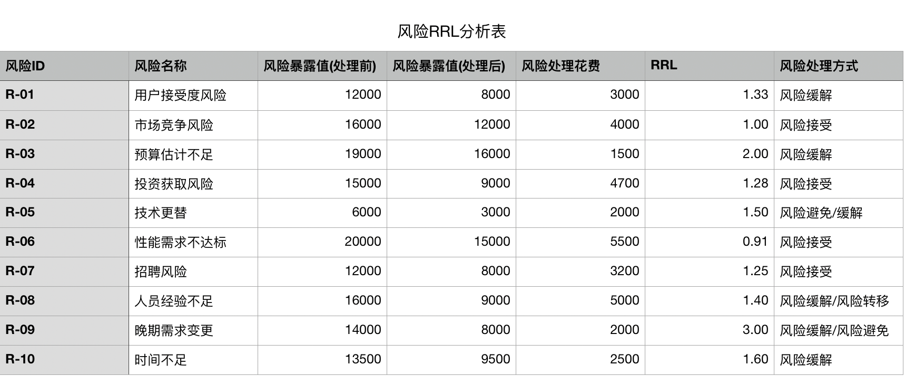
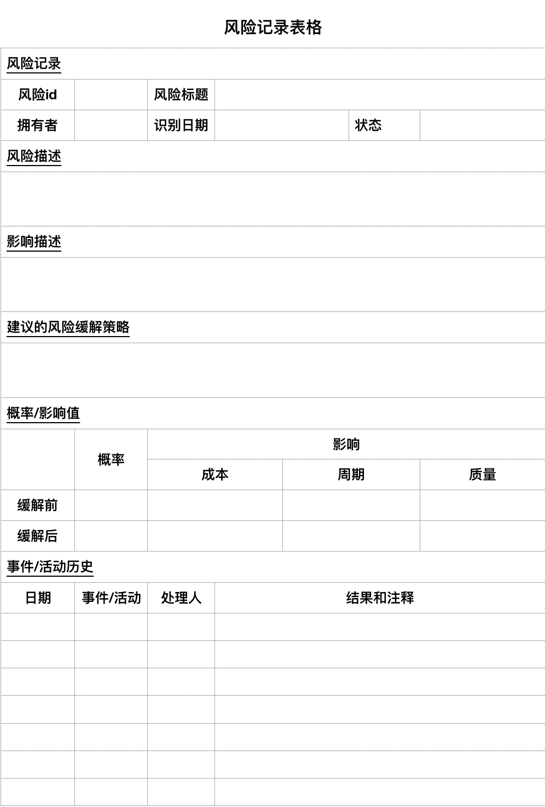

### Risk managment

#### Risk Identification

基于调查和研究，使用检查单和头脑风暴的方法，我们主要讨论出10种可能会发生的风险

#### Market Risk

- 客户接受度风险

  其他的现有公司可能不愿意花费精力来更新他们现有的缓存系统，因为他们担心可能存在的风险性。由于任何一个公司在更新基础设施时会保持非常理性的态度，所以已经拥有一个庞大系统的公司很大程度上不愿意拥抱新技术，拥抱新的变化。这对于我们的项目是一个比较大的风险，因为我们很有可能只能将产品使用于一些初创的小企业中，而这样做对于公司的影响力提升有限，难以得到良好的推广。

- 市场竞争风险

  现在市面上已经有一些主流的内存kv数据库存在，并且应用很广泛，如redis和memcached等外国公司开发的产品，市场竞争压力较大。现存的大多数互联网公司使用redis作为数据库的二级缓存，使用memcached作为LRU缓存，这两个产品均已是较为成熟的产品，拥有较大的供给需求。

#### Financial Risk

- 预算估计不足

  软件开发过程与费用管理是形影不离的。开发花销，管理开销，设备的开销等。一旦某些开销比预期要高，可能会造成整个项目停止。由于开发此类项目的公司较少，我们不易获得类似的费用控制经验，从而可能造成此类的风险。

- 投资获取风险

  项目存在融资困难的风险。由于本项目为基础架构性项目，而非应用级别项目，所以落地后无法立刻变现，这也就导致了融资的困难。投资人会认为该项目风险比较高，项目变现困难。所以公司应尽可能吸引天使投资。

#### Technology Risk

- 技术更替

  在项目开发的途中，我们有可能遇到其他更新的技术手段，从而导致前有的设计失效的情况，或者导致现有设计不足以使产品达到较高性能，从而降低了竞争力。

- 性能需求不足

  由于该项目所需技术较为尖端，所以在前期的迭代中，项目的并发性能可能无法达到既定需求，从而无法满足客户需要。

#### People Risk

- 招聘风险

  由于尖端底层架构开发人员的稀缺性，公司很难招聘到合乎要求的工程师，这也就造成了开发人员短缺的风险。同时有用类似项目管理经验，金融分析经验的人员同样是稀缺资源，所以公司面临各方面的人员招聘风险。

- 人员经验不足

  由于现有的开发人员很有可能面临经验不足的情况，软件质量有难以得到保障的风险。项目管理团队同样面临着经验不足的风险，由于需要和各类企业，如国有企业，中小企业进行商讨，会需要一些具有经验的商业团队，而经验不足的团队很容易使得产品腹死胎中。

#### Structure/Process Risk

- 晚期的需求变更

  需求变更最好处于项目的初期。需求在分析阶段被确定。而在后面的阶段，项目有可能在进行开发途中遭受需求变更，而导致开发计划收到挫折的风险，而有可能造成没有预期到的费用超支，还有可能导致工期延后，使得整个项目迭代周期推迟。

- 时间不足

  项目的时间估计在项目开始的初期是十分难以解决的问题，而且由于缺乏相关开发底层基础架构级别项目经验的项目管理团队，很有可能造成的局面是项目的预估迭代周期与实际大相径庭，从而造成约定好的雇佣时间变得不可靠，从而会造成各类问题，如人员的开销问题，资金的周转问题，资源不足，资源分配不均衡等问题。

### Risk Analysis

#### 风险可能性等级

| Level | 可能性等级 | 等级定义 | 描述         |
| ----- | ---------- | -------- | ------------ |
| 5     | >80%       | 较高     | 很可能发生   |
| 4     | 61%~80%    | 高       | 有可能发生   |
| 3     | 41%~60%    | 中       | 不确定       |
| 2     | 21%~40%    | 低       | 较稀少       |
| 1     | 0%~20%     | 较低     | 基本不会发生 |

#### 风险严重性等级

| Level | Description  | 描述             |
| ----- | ------------ | ---------------- |
| 5     | 使得项目失败 | 使得整个项目失败 |
| 4     | 严重         | 对项目造成伤害   |
| 3     | 中等         | 给项目带来麻烦   |
| 2     | 较轻         | 影响项目进展     |
| 1     | 轻微         | 基本没有影响     |

#### 风险等级确定方法

$$
风险 = 风险可能性级别 \times 风险严重性级别
$$

#### 风险风险及评估摘要

#### 可能性/严重性矩阵

根据该矩阵，我们选出四个最重要的风险：

- 时间不足
- 预算估计不足
- 招聘风险
- 投资获取风险

### 定性分析

#### Market Risk

- 客户接受度风险

  - 分析

    其他的现有公司可能不愿意花费精力来更新他们现有的缓存系统，因为他们担心可能存在的风险性。由于任何一个公司在更新基础设施时会保持非常理性的态度，所以已经拥有一个庞大系统的公司很大程度上不愿意拥抱新技术，拥抱新的变化。这对于我们的项目是一个比较大的风险，因为我们很有可能只能将产品使用于一些初创的小企业中，而这样做对于公司的影响力提升有限，难以得到良好的推广。

  - 短期解决方案

    将我们的产品开源到各大代码托管网站上，建立具有良好推广效果的官方网站，编写易于学习的使用文档，从而提升项目影响力，

- 市场竞争风险

  - 分析

    现在市面上已经有一些主流的内存kv数据库存在，并且应用很广泛，如redis和memcached等外国公司开发的产品，市场竞争压力较大。现存的大多数互联网公司使用redis作为数据库的二级缓存，使用memcached作为LRU缓存，这两个产品均已是较为成熟的产品，拥有较大的供给需求。

  - 短期解决方案

    我们可以在现有方案的基础上，增加其他市面上kv数据库所不含有的功能，以期望提高市场影响力。同时，我们可以给某些初创企业，或中小企业提供免费产品服务，并提供全套使用帮助，以提高竞争力。从而提升产品在行业内的口碑。

#### Financial Risk

- 预算估计不足

  - 分析

    软件开发过程与费用管理是形影不离的。开发花销，管理开销，设备的开销等。一旦某些开销比预期要高，可能会造成整个项目停止。由于开发此类项目的公司较少，我们不易获得类似的费用控制经验，从而可能造成此类的风险。

  - 短期解决方案

    尽可能使用多种方案来评估预算。理性的估计现有的资源。在关键的预算估计问题上可以聘请专业顾问进行指导。

- 投资获取风险

  - 分析

    项目存在融资困难的风险。由于本项目为基础架构性项目，而非应用级别项目，所以落地后无法立刻变现，这也就导致了融资的困难。投资人会认为该项目风险比较高，项目变现困难。

  - 短期解决方案

    尝试获取天使轮融资，以减轻资金压力。尝试与其他大学内部实验室进行合作，尽力减免开支。

#### Technology Risk

- 技术更替

  - 分析

    在项目开发的途中，我们有可能遇到其他更新的技术手段，从而导致前有的设计失效的情况，或者导致现有设计不足以使产品达到较高性能，从而降低了竞争力。

  - 短期解决方案

    尽可能地选用扩展性良好的技术栈，谨慎地选择使用的技术栈。

- 性能需求不足

  - 分析

    由于该项目所需技术较为尖端，所以在前期的迭代中，项目的并发性能可能无法达到既定需求，从而无法满足客户需要。

  - 短期解决方案

    开发人员和设计人员需要进行多轮技术分析，了解技术选型内幕。尽可能多的进行性能测试。在关键性能问题上，尽可能聘请技术专家来进行指导。

#### People Risk

- 招聘风险

  - 分析

    由于尖端底层架构开发人员的稀缺性，公司很难招聘到合乎要求的工程师，这也就造成了开发人员短缺的风险。同时有用类似项目管理经验，金融分析经验的人员同样是稀缺资源，所以公司面临各方面的人员招聘风险。

  - 短期解决方案

    使用尽可能多的方式进行招聘，如从各种不同的招聘网站展开招聘，使用猎头进行挖角等。并且公司应尝试与大学内部的尖端实验室团队展开合作。

- 人员经验不足

  - 分析

    由于现有的开发人员很有可能面临经验不足的情况，软件质量有难以得到保障的风险。项目管理团队同样面临着经验不足的风险，由于需要和各类企业，如国有企业，中小企业进行商讨，会需要一些具有经验的商业团队，而经验不足的团队很容易使得产品腹死胎中。

  - 短期解决方案

    尝试招聘少量的具有丰富经验的资深开发人员，以及某些技术专家，在公司内部展开经验分享，技术培训。聘请少数技术专家作为技术顾问，指导公司员工进行开发。

#### Structure/Process Risk

- 晚期的需求变更

  - 分析

    需求变更最好处于项目的初期。需求在分析阶段被确定。而在后面的阶段，项目有可能在进行开发途中遭受需求变更，而导致开发计划收到挫折的风险，而有可能造成没有预期到的费用超支，还有可能导致工期延后，使得整个项目迭代周期推迟。

  - 短期解决方案

    风险的解决方法在于设计人员应使用良好的设计方案，编码人员编码中尽量多的使用合适的设计模式，以及尽可能多的使用go语言的面向接口编程思想进行编程，使得Godis拥有良好的可扩展性。

- 时间不足

  - 分析

    项目的时间估计在项目开始的初期是十分难以解决的问题，而且由于缺乏相关开发底层基础架构级别项目经验的项目管理团队，很有可能造成的局面是项目的预估迭代周期与实际大相径庭，从而造成约定好的雇佣时间变得不可靠，从而会造成各类问题，如人员的开销问题，资金的周转问题，资源不足，资源分配不均衡等问题。

  - 短期解决方案

    公司的管理团队应该尝试使用更多的方式进行工作量预估，并且应该尽可能的去搜索国外现有公司的以往项目案例，来进行商业评估分析，工作量分析等，来获取经验。

### Risk Management Plan

使用风险缓解效率公式来制定风险管理的计划：
$$
RRL = \frac{Risk\space Exposure\space Before - Risk\space Exposure\space After}{Cost\space of\space Risk\space Reduction}
$$

#### 策略

将RRL大于等于1.40的风险采取Risk Reduction的策略进行处理，RRL低于1.40者根据定性分析情况，尽可能采取合理的措施。

根据以上表格，我们主要需要对以下6类风险进行管理记录

1. 用户接受度风险
2. 预算估计不足
3. 技术更替
4. 人员经验不足
5. 晚期需求变更
6. 时间不足

使用风险记录表的方式在项目进展过程中监控和跟踪风险的状况。

使用以下表格进行记录：

这里以**晚期需求变更**风险为例，分析如何记录并跟踪风险。

